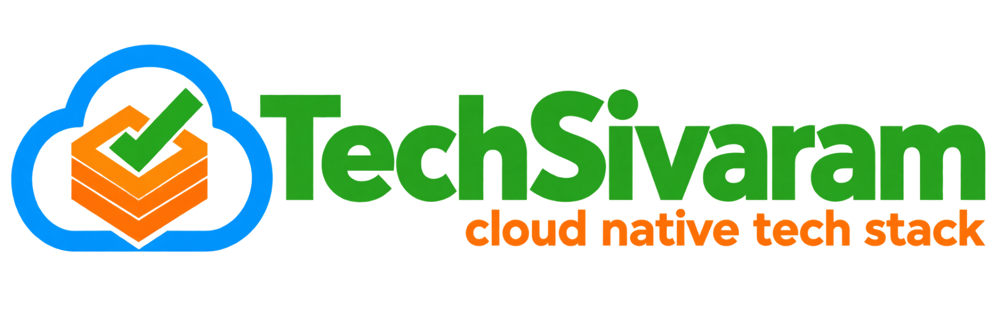

<div align="center">



# Building Solutions That Scale.

### Technology Enables a Better Tomorrow.

<p>
  <a href="https://techsivaram.com/"></a>
  <a href="https://www.youtube.com/@techsivaram"></a>
  <a href="https://medium.com/@sivaram.movva"></a>
  <a href="https://www.linkedin.com/company/techsivaram"></a>
  <a href="https://github.com/TechSivaram"></a>
</p>

<p>
  <b>☁️ Cloud Native</b> &nbsp;•&nbsp;
  <b>🏗️ Architecture</b> &nbsp;•&nbsp;
  <b>🤖 AI</b> &nbsp;•&nbsp;
  <b>🔐 Security</b> &nbsp;•&nbsp;
  <b>🚀 DevOps</b> &nbsp;•&nbsp;
  <b>💡 Open Source</b>
</p>

</div>

<p align="center">
  <a href="https://github.com/TechSivaram">
    
  </a>
</p>

---

## 🚀 What We Do

> We **design, build, modernize, and optimize technology solutions** that are secure, scalable, cloud-native, AI-ready, and cost-optimized.

<table>
<tr>
<td width="50%">

### ☁️ Cloud & Architecture
Scalable solutions across AWS and Azure, cloud-native platforms, distributed systems, microservices and APIs.

### 🏗️ Application Modernization
Re-platforming and modernization of enterprise applications and legacy systems.

### ⚙️ Cloud-Native Engineering
Microservices, containers, Kubernetes, APIs and production-ready distributed systems.

### 🤖 AI & Generative AI
Practical integration of Generative AI, RAG, SLMs and intelligent capabilities.

</td>
<td width="50%">

### 🔐 Security & Compliance
Security-by-design, identity, access, risk management and regulated workloads.

### 📊 Performance & Cost Optimization
Performance engineering, scalability, reliability and cloud economics.

### 🏥 Healthcare Technology
FHIR, SMART on FHIR, healthcare interoperability and healthcare platforms.

### 🚀 DevOps & Platform Engineering
Automation, CI/CD, infrastructure, deployment, monitoring and operations.

</td>
</tr>
</table>

---

## 🧠 Expertise

We bring hands-on experience across the technologies below.


### Application & Web

                  

### Cloud & Platform

      

### Data

     

### Languages

       

### Developer Tools

    

### Payments

  

### Real-Time & Integration

    

### Source Control

    

### Healthcare

 


---

## 🏥 Healthcare & Interoperability

<div align="center">

`FHIR` &nbsp; `SMART on FHIR` &nbsp; `FHIR Works on AWS` &nbsp; `Mirth Connect` &nbsp; `EPIC` &nbsp; `CERNER`

**Secure healthcare architecture • interoperability • system integration**

</div>

---

## 🤖 AI & Generative AI

| | |
|---|---|
| 🧠 **Generative AI** | AI-enabled enterprise applications |
| 🔎 **RAG** | Retrieval-Augmented Generation |
| 🪶 **SLMs** | Small Language Models |
| ☁️ **AI + Cloud** | Practical integration with cloud-native systems |

---

## 🧩 Products

<table>
<tr>
<td width="50%" align="center">

# 🔐 TSCloak

### Secure Identities. Trusted Access.

**Open Source Identity & Access Management**

`OAuth 2.0` • `OpenID Connect` • `JWT` • `JWKS` • `PKCE`

**[Explore TSCloak →](https://techsivaram.com/tscloak/)**

</td>
<td width="50%" align="center">

# ✈️ ViLek

### Fly • Track • Claim

**Digital Flight Ledger**

Expense management for flight crew, including receipt and claim workflows.

**[Explore ViLek →](https://techsivaram.com/vilek/)**

</td>
</tr>
</table>

---

## 💡 Open Source & Knowledge Sharing

We use this organization to **build, share and learn** through:

```text
┌─────────────────────────────────────────────────────────┐
│  Open Source Projects                                   │
│  Cloud-Native Reference Implementations                 │
│  Architecture Examples                                  │
│  Developer Tools                                        │
│  AI Experiments                                         │
│  Reusable Engineering Patterns                          │
│  Technical Articles & Learning Resources                │
└─────────────────────────────────────────────────────────┘
```

### Learn • Build • Share • Grow • Together

---

## 🌐 Connect With TechSivaram

<div align="center">

<a href="https://techsivaram.com/"></a>
<a href="https://www.youtube.com/@techsivaram"></a>
<a href="https://medium.com/@sivaram.movva"></a>
<a href="https://www.linkedin.com/company/techsivaram"></a>

</div>

---

## 👤 Founder

<div align="center">

### Sivaram Movva

**Founder & Principal Cloud Applications Architect**

TechSivaram is founded on more than two decades of experience designing, building and delivering complex enterprise technology solutions across cloud architecture, application modernization, software engineering, security, performance optimization, healthcare interoperability, technical leadership and emerging AI technologies.

> **Building Solutions That Scale.**

</div>

---

<div align="center">

### Technology Enables a Better Tomorrow.

**TechSivaram**

**Learn • Build • Share • Grow • Together**

</div>
